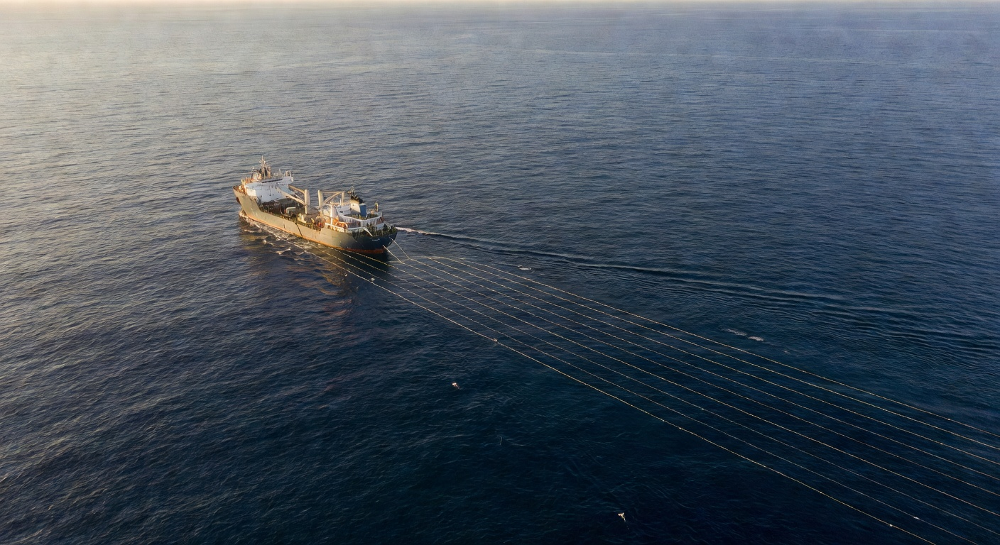

# FGPS Scroll Experience v2 — Compass Node Navigation

## Core Concept
A zig-zag trail of **compass nodes** (octagonal or circular cards) connected by animated lines. As you scroll, each node **expands** to reveal its content (product info, stats, testimonials), then **contracts** as the next node slides into position. The network isn't decoration — it IS the layout.

## What Changed from v1
- **Remove SVG vessel from hero** — bring back `hero-v3.png` (the real vessel photo) as the hero background
- **Remove pinned scroll sections** — no more endless scrolling before content moves. Natural page flow.
- **Remove video element** — replace with **native animated SVG** that does what the video showed (network lines pulsing, nodes glowing, subtle seismic wave patterns)
- **Nodes ARE the content cards** — bigger nodes that expand in-place to reveal information
- **Zig-zag layout** — nodes alternate left/right down the page, connected by animated lines
- **Fix contrast** — all card backgrounds minimum `#1a2340`, text minimum `rgba(255,255,255,0.9)`
- **Fix stats/years box** — the hero stats (25+ years, 1000s surveys, etc.) must render correctly

## Visual Flow

### Hero Section
- **Background**: `hero-v3.png` (existing vessel photo) with dark overlay
- **Animated ambient layer**: SVG network lines pulse subtly behind content (replaces video)
  - Thin teal lines (`rgba(0,212,170,0.08)`) form a loose grid/network pattern
  - Small nodes (`r=3-4px`) at intersections glow softly
  - Subtle pulse animation on connections (opacity oscillates)
  - This is BEHIND the hero content, purely ambient
- **Content**: Headline, subtext, CTA buttons, stats bar — same as original
- **Stats bar**: Must show "25+ Years in seismic", "1000s Surveys processed", "24/7 Expert support", "10+ Specialist products" with correct formatting and contrast

### Compass Node Trail (Main Content)
Layout: nodes arranged in a zig-zag path down the page.

```
     [Node 1] ─────────
                        \
                    [Node 2] ─────
                   /
     [Node 3] ────
                   \
                    [Node 4] ────
                   /
     [Node 5] ────
         ...
```

**Each node is**:
- Octagonal or circular shape (60-80px "closed" state)
- Has a teal border/glow, label visible when closed
- Connected to neighbors by animated SVG lines (teal, thin)
- **On scroll into view**: expands smoothly (GSAP) to reveal a content card (~300-400px wide)
  - Card has dark background (`#1a2340` minimum), clear text
  - Shows: label, title, description, link
  - For products: product name, one-liner, "View specifications →"
  - For trust items: stat number, description
  - For testimonials: quote text, attribution
- **On scroll past**: contracts back to node, connection line animates to next node
- The expanding/contracting is smooth — `gsap.to` with `scrollTrigger: { scrub: true }`

### Node Content Map
1. **SeisPos** — "The complete P2-to-P1 processing engine"
2. **SPSPro** — "All aspects of SPS-format positioning data"
3. **SeisBin** — "Comprehensive 3D coverage visualisation"
4. **SeisCloudNAV** — "Real-time navigation QC in your browser" (highlighted node — cloud badge)
5. **Built by Surveyors** — "Founded 2000, 45+ years combined experience"
6. **Field-Tested** — "Every product tested against real survey data"
7. **Seamless Integration** — "P2 to P1, every step with dedicated tools"
8. **Trust** — Client names (PGS, CGG, TGS, Shearwater, etc.) + stats
9. **Testimonial** — "FGPS software developed in the field and office..."
10. **CTA** — "Start the Conversation" — contact details, buttons

### Mobile (≤768px)
- Nodes stack vertically (no zig-zag)
- No scroll-scrub animations — simple fade-in on scroll
- Nodes start expanded (cards visible immediately)
- Connecting lines become simple vertical dashes
- Hero stats stack 2x2

## Technical Spec

### HTML Structure
```html
<!-- Hero with vessel photo (restored) -->
<section class="hero">
  <div class="hero-bg"></div>
  <div class="hero-overlay"></div>
  <svg class="hero-network-ambient" aria-hidden="true">...</svg>
  <div class="container">
    <div class="hero-content">...</div>
  </div>
</section>

<!-- Node Trail -->
<section class="node-trail">
  <svg class="trail-connections" aria-hidden="true">
    <!-- JS draws connecting lines between nodes -->
  </svg>
  
  <div class="trail-node trail-node--left" data-index="0">
    <div class="node-dot"><span class="node-label">SeisPos</span></div>
    <div class="node-card">
      <span class="node-card-tag">Processing</span>
      <h3>SeisPos</h3>
      <p>The complete P2-to-P1 processing engine...</p>
      <a href="products.html#seispos" class="node-card-link">View specifications →</a>
    </div>
  </div>
  
  <div class="trail-node trail-node--right" data-index="1">
    ...
  </div>
  <!-- etc -->
</section>

<!-- CTA -->
<section class="section-cta">...</section>
```

### CSS Key Points
- `.trail-node`: position relative, margin between nodes for scroll space
- `.node-dot`: the closed state — circle/octagon, centered
- `.node-card`: initially `opacity: 0; scale: 0.8; max-height: 0` — GSAP animates open
- Card backgrounds: `#1a2340` minimum (WCAG AA on `#0a0f1c` page bg)
- Text: `rgba(255,255,255,0.9)` body, `#fff` headings
- Teal accents: `#00d4aa` for borders, node dots, connection lines
- Amber: `#f5a623` for highlights only (SeisCloudNAV badge)

### JS / GSAP
- Each `.trail-node` gets a ScrollTrigger that:
  - On enter: expands `.node-card` (opacity 1, scale 1, max-height auto)
  - Animates the connecting line "drawing" from previous node
  - On leave: contracts card back
- `scrub: 0.5` for smooth scroll-tied motion
- NO `pin: true` — normal page flow, no scroll-jacking
- Mouse parallax on desktop: subtle node position shift on mousemove
- Ambient hero network: CSS keyframe animation (no ScrollTrigger needed)
- Safety net: 5s timeout forces all cards visible if animations fail

### Contrast Requirements
- Body text: minimum 4.5:1 against background (WCAG AA)
- Card bg: `#1a2340` on `#0a0f1c` → 1.5:1 (sufficient card distinction)
- Text on card: `rgba(255,255,255,0.9)` on `#1a2340` → ~12:1 ✓
- Teal on dark: `#00d4aa` on `#0a0f1c` → ~8:1 ✓
- Stats numbers: `#fff` bold, `#00d4aa` for labels
- Never use `rgba(255,255,255,0.5)` or lower for readable text

### What to Keep from Current
- Navbar (unchanged)
- Footer (unchanged)
- Color palette (navy/teal/amber)
- Typography (Inter + JetBrains Mono)
- Claim widget
- Other pages (products.html, services.html, about.html, contact.html) — main.js must still handle their animations

### What to Remove
- SVG vessel drawing (the hand-drawn SVG boat)
- Pinned scroll sections (no more `pin: true`)
- Video background element
- The "act" structure (act-hero, act-products, etc.)
- Streamer/cable SVG elements
